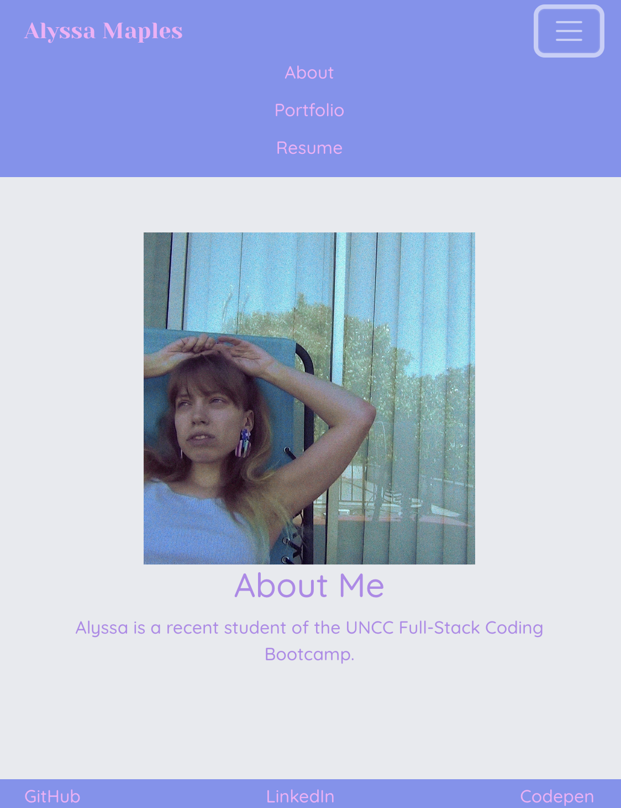

# React Portfolio

  
## Description
This application is a basic portfolio using React. There are three pages to view: About, Portfolio, and Resume. Links are given at the bottom for the user's external pages.

## Table of Contents
- [Application Preview](#application-preview)
- [Deployed Application](#deployed-application)
- [Questions](#questions)
- [License](#license)

## Application Preview

## Deployed Application
[Click here to view the Deployed Application on Heroku](https://radiant-meadow-15180.herokuapp.com/)

## Questions
Please visit my [GitHub Page](https://github.com/armaples) or [email me](mailto:raynemaples@gmail.com).
  
## License
Distributed under the MIT License. Please follow [this link](https://opensource.org/licenses/MIT) for more information, or click on the badge at the top.